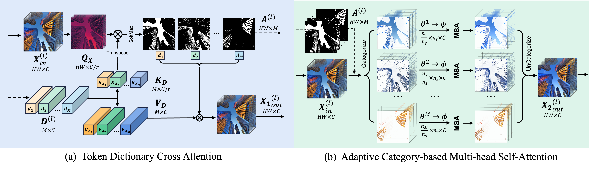
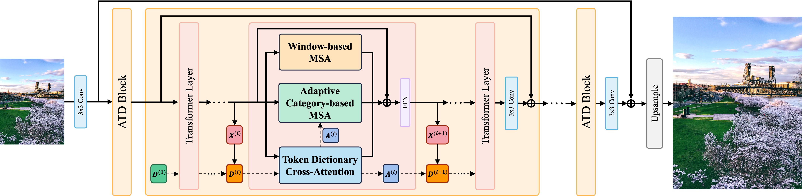
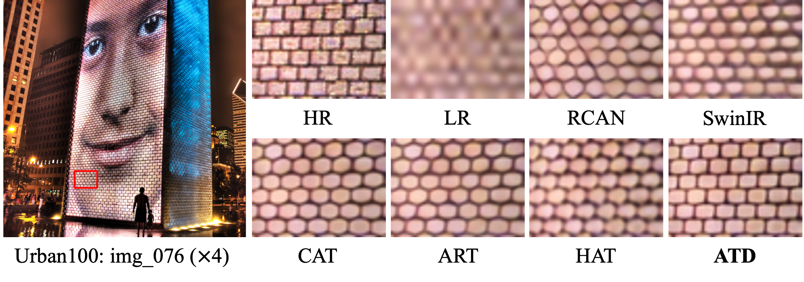
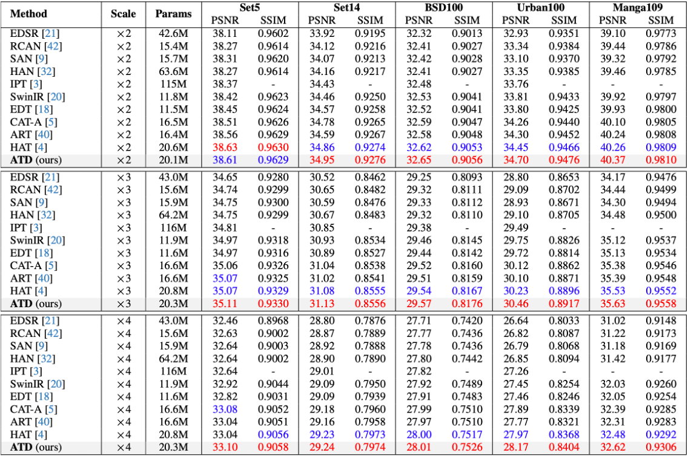
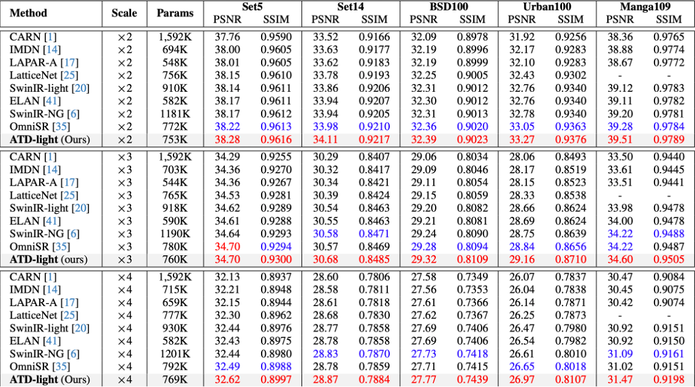
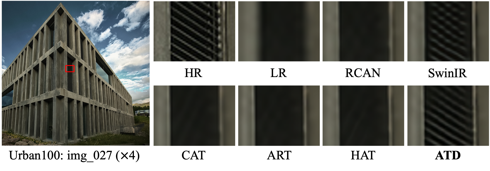
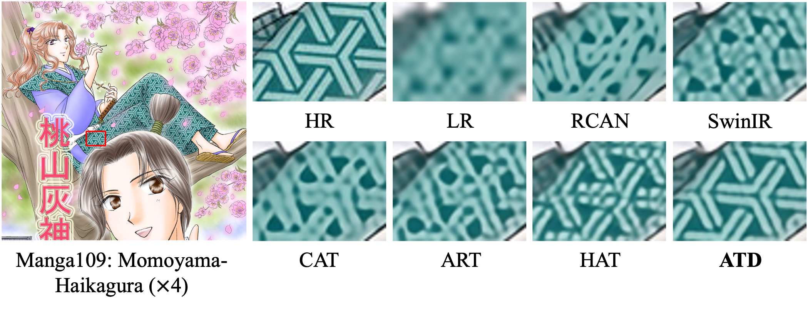

# Adaptive Token Dictionary

This repository is an official implementation of the paper "Transcending the Limit of Local Window: Advanced Super-Resolution Transformer with Adaptive Token Dictionary", CVPR, 2024.

[[Arxiv](https://arxiv.org/abs/2401.08209)] [[visual results](https://drive.google.com/drive/folders/1HwEbAGU6WEw9ZGbFdt__BOJo_5DKflEb?usp=sharing)] [[pretrained models](https://drive.google.com/drive/folders/1D3BvTS1xBcaU1mp50k3pBzUWb7qjRvmB?usp=sharing)]

By Leheng Zhang, Yawei Li, Xingyu Zhou, Xiaorui Zhao, and Shuhang Gu.

> **Abstract:** Single Image Super-Resolution is a classic computer vision problem that involves estimating high-resolution (HR) images from low-resolution (LR) ones. Although deep neural networks (DNNs), especially Transformers for super-resolution, have seen significant advancements in recent years, challenges still remain, particularly in limited receptive field caused by window-based self-attention. To address these issues, we introduce a group of auxiliary **A**daptive **T**oken **D**ictionary to SR Transformer and establish an **ATD**-SR method. The introduced token dictionary could learn prior information from training data and adapt the learned prior to specific testing image through an adaptive refinement step. The refinement strategy could not only provide global information to all input tokens but also group image tokens into categories. Based on category partitions, we further propose a category-based self-attention mechanism designed to leverage distant but similar tokens for enhancing input features. The experimental results show that our method achieves the best performance on various single image super-resolution benchmarks.
> 
>  
>  
> <br/><br/>
> 


## Contents
1. [Enviroment](#environment)
1. [Training](#training)
1. [Testing](#testing)
1. [Results](#results)
1. [Visual Results](#visual-results)
1. [Citation](#citation)
1. [Acknowledgements](#acknowledgements)


## Environment
- Python 3.9
- PyTorch 2.0.1

### Installation
```bash
git clone https://github.com/LabShuHangGU/Adaptive-Token-Dictionary.git

conda create -n ATD python=3.9
conda activate ATD

pip install -r requirements.txt
python setup.py develop
```


## Training
### Data Preparation
- Download the training dataset DF2K ([DIV2K](https://data.vision.ee.ethz.ch/cvl/DIV2K/) + [Flickr2K](https://cv.snu.ac.kr/research/EDSR/Flickr2K.tar)) and put them in the folder `./datasets`.

### Training Commands
- Refer to the training configuration files in `./options/train` folder for detailed settings.
- ATD (Classical Image Super-Resolution)
```bash
# batch size = 8 (GPUs) × 4 (per GPU)
# training dataset: DF2K

# ×2 scratch, input size = 64×64, 300k iterations
CUDA_VISIBLE_DEVICES=0,1,2,3,4,5,6,7 python -m torch.distributed.launch --use-env --nproc_per_node=8 --master_port=1145  basicsr/train.py -opt options/train/000_ATD_SRx2_scratch.yml --launcher pytorch
# ×2 finetune, input size = 96×96, 250k iterations
CUDA_VISIBLE_DEVICES=0,1,2,3,4,5,6,7 python -m torch.distributed.launch --use-env --nproc_per_node=8 --master_port=1145  basicsr/train.py -opt options/train/001_ATD_SRx2_finetune.yml --launcher pytorch

# ×3 finetune, input size = 96×96, 250k iterations
CUDA_VISIBLE_DEVICES=0,1,2,3,4,5,6,7 python -m torch.distributed.launch --use-env --nproc_per_node=8 --master_port=1145  basicsr/train.py -opt options/train/002_ATD_SRx3_finetune.yml --launcher pytorch

# ×4 finetune, input size = 96×96, 250k iterations
CUDA_VISIBLE_DEVICES=0,1,2,3,4,5,6,7 python -m torch.distributed.launch --use-env --nproc_per_node=8 --master_port=1145  basicsr/train.py -opt options/train/003_ATD_SRx4_finetune.yml --launcher pytorch
```

- ATD-light (Lightweight Image Super-Resolution)
```bash
# batch size = 2 (GPUs) × 16 (per GPU)
# training dataset: DIV2K

# ×2 scratch, input size = 64×64, 500k iterations
CUDA_VISIBLE_DEVICES=0,1 python -m torch.distributed.launch --use-env --nproc_per_node=2 --master_port=1145  basicsr/train.py -opt options/train/101_ATD_light_SRx2_scratch.yml --launcher pytorch

# ×3 finetune, input size = 64×64, 250k iterations
CUDA_VISIBLE_DEVICES=0,1 python -m torch.distributed.launch --use-env --nproc_per_node=2 --master_port=1145  basicsr/train.py -opt options/train/102_ATD_light_SRx3_finetune.yml --launcher pytorch

# ×4 finetune, input size = 64×64, 250k iterations
CUDA_VISIBLE_DEVICES=0,1 python -m torch.distributed.launch --use-env --nproc_per_node=2 --master_port=1145  basicsr/train.py -opt options/train/103_ATD_light_SRx4_finetune.yml --launcher pytorch
```


## Testing
### Data Preparation
- Download the testing data (Set5 + Set14 + BSD100 + Urban100 + Manga109 [[download](https://drive.google.com/file/d/1_FvS_bnSZvJWx9q4fNZTR8aS15Rb0Kc6/view?usp=sharing)]) and put them in the folder `./datasets`.

### Pretrained Models
- Download the [pretrained models](https://drive.google.com/drive/folders/1D3BvTS1xBcaU1mp50k3pBzUWb7qjRvmB?usp=sharing) and put them in the folder `./experiments/pretrained_models`.

### Testing Commands
- Refer to the testing configuration files in `./options/test` folder for detailed settings.
- ATD (Classical Image Super-Resolution)
```bash
python basicsr/test.py -opt options/test/001_ATD_SRx2_finetune.yml
python basicsr/test.py -opt options/test/002_ATD_SRx3_finetune.yml
python basicsr/test.py -opt options/test/003_ATD_SRx4_finetune.yml
```

- ATD-light (Lightweight Image Super-Resolution)
```bash
python basicsr/test.py -opt options/test/101_ATD_light_SRx2_scratch.yml
python basicsr/test.py -opt options/test/102_ATD_light_SRx3_finetune.yml
python basicsr/test.py -opt options/test/103_ATD_light_SRx4_finetune.yml
```


## Results
- Classical Image Super-Resolution



- Lightweight Image Super-Resolution



## Visual Results

- Complete visual results can be downloaded from [link](https://drive.google.com/drive/folders/1HwEbAGU6WEw9ZGbFdt__BOJo_5DKflEb?usp=sharing).





## Citation

```
@misc{zhang2024transcending,
      title={Transcending the Limit of Local Window: Advanced Super-Resolution Transformer with Adaptive Token Dictionary}, 
      author={Leheng Zhang and Yawei Li and Xingyu Zhou and Xiaorui Zhao and Shuhang Gu},
      year={2024},
      eprint={2401.08209},
      archivePrefix={arXiv},
      primaryClass={cs.CV}
}
```

## Acknowledgements
This code is built on [BasicSR](https://github.com/XPixelGroup/BasicSR).

